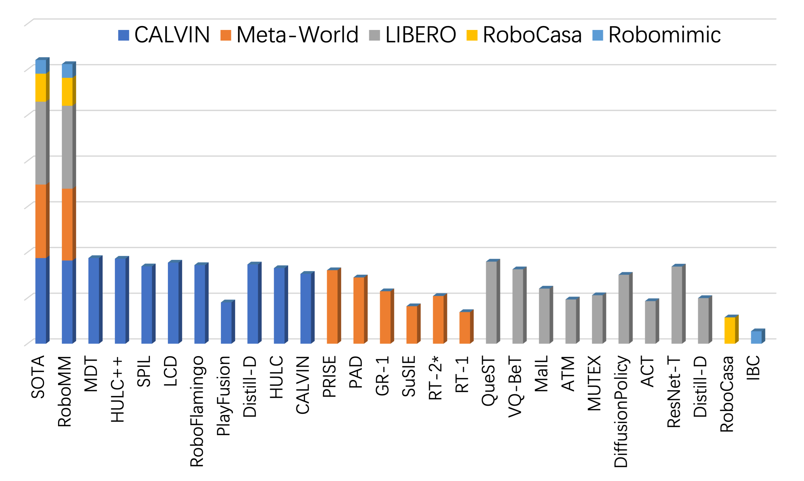

# RoboMM: All-in-One Multimodal Large Model for Robotic Manipulation
### 🚩[Project Page](https://robouniview.github.io/RoboMM.github.io/) | 📑[Paper](https://arxiv.org/pdf/2412.07215v1) | 🤗[Data](https://huggingface.co/datasets/liufanfanlff/RoboData)


This is the unorganized version of the code for RoboMM: All-in-One Multimodal Large Model for Robotic Manipulation.

In recent years, robotics has advanced significantly through the integration of larger models and large-scale datasets. However, challenges remain in applying these models to 3D spatial interactions and managing data collection costs. To address these issues, we propose the multimodal robotic manipulation model, **RoboMM**, along with the comprehensive dataset, **RoboData**.
**RoboMM** enhances 3D perception through camera parameters and occupancy supervision. Building on OpenFlamingo, it incorporates Modality-Isolation-Mask and multimodal decoder blocks, improving modality fusion and fine-grained perception. % , thus boosting performance in robotic manipulation tasks.
**RoboData** offers the complete evaluation system by integrating several well-known datasets, achieving the first fusion of multi-view images, camera parameters, depth maps, and actions, and the space alignment facilitates comprehensive learning from diverse robotic datasets.
Equipped with **RoboData** and the unified physical space, **RoboMM** is the first generalist policy that enables simultaneous evaluation across all tasks within multiple datasets, rather than focusing on limited selection of data or tasks.
Its design significantly enhances robotic manipulation performance, increasing the average sequence length on the CALVIN from 1.7 to 3.3 and ensuring cross-embodiment capabilities, achieving state-of-the-art results across multiple datasets. The code will be released following acceptance.


## Performance



## Training the model (using DDP):

```
bash tools/train.sh 8 --config ${config}

```

## Evaluating the model
```
bash tools/test.sh 8 ${ckpt}
```

## Acknowledgment

#### CALVIN
Original:  [https://github.com/mees/calvin](https://github.com/mees/calvin)
License: [MIT](https://github.com/mees/calvin/blob/main/LICENSE)

#### Meta-World 
Original: [https://github.com/Farama-Foundation/Metaworld](https://github.com/Farama-Foundation/Metaworld)
License: [MIT](https://github.com/Farama-Foundation/Metaworld/blob/master/LICENSE)

#### LIBERO
Original: [https://github.com/Lifelong-Robot-Learning/LIBERO](https://github.com/Lifelong-Robot-Learning/LIBERO)
License: [MIT](https://github.com/Lifelong-Robot-Learning/LIBERO/blob/master/LICENSE)

#### RoboCasa
Original: [https://github.com/robocasa/robocasa](https://github.com/robocasa/robocasa)
License: [MIT](https://github.com/robocasa/robocasa/blob/main/LICENSE)

#### RoboMimic
Original: [https://github.com/ARISE-Initiative/robomimic]([https://github.com/Farama-Foundation/Metaworld](https://github.com/ARISE-Initiative/robomimic))
License: [MIT](https://github.com/ARISE-Initiative/robomimic/blob/master/LICENSE)

#### RoboCAS
Original: [https://github.com/notFoundThisPerson/RoboCAS-v0](https://github.com/notFoundThisPerson/RoboCAS-v0)
License: [MIT](https://github.com/notFoundThisPerson/RoboCAS-v0/blob/main/LICENSE)

#### RLBench
Original: [https://github.com/stepjam/RLBench](https://github.com/stepjam/RLBench)
License: [MIT](https://github.com/stepjam/RLBench/blob/master/LICENSE)

### Colosseum
Original: [https://github.com/robot-colosseum/robot-colosseum](https://github.com/robot-colosseum/robot-colosseum)
License: [MIT](https://github.com/stepjam/RLBench/blob/master/LICENSE)

### Maniskill2
Original: [https://github.com/haosulab/ManiSkill/tree/v0.5.3](https://github.com/haosulab/ManiSkill/tree/v0.5.3)
License: [Apache](https://github.com/haosulab/ManiSkill/blob/v0.5.3/LICENSE)


#### OpenAI CLIP
Original: [https://github.com/openai/CLIP](https://github.com/openai/CLIP)
License: [MIT](https://github.com/openai/CLIP/blob/main/LICENSE)

#### OpenFlamingo
Original: [https://github.com/mlfoundations/open_flamingo](https://github.com/mlfoundations/open_flamingo)
License: [MIT](https://github.com/mlfoundations/open_flamingo/blob/main/LICENSE)

#### RoboFlamingo
Original: [https://github.com/RoboFlamingo/RoboFlamingo](https://github.com/RoboFlamingo/RoboFlamingo)
License: [MIT](https://github.com/RoboFlamingo/RoboFlamingo/blob/main/LICENSE)

#### RoboUniview
Original: [https://github.com/RoboUniview/RoboUniview](https://github.com/RoboUniview/RoboUniview)
License: [MIT](https://github.com/RoboFlamingo/RoboFlamingo/blob/main/LICENSE)

## Cite our work:
```
@misc{yan2024robommallinonemultimodallarge,
      title={RoboMM: All-in-One Multimodal Large Model for Robotic Manipulation}, 
      author={Feng Yan and Fanfan Liu and Liming Zheng and Yufeng Zhong and Yiyang Huang and Zechao Guan and Chengjian Feng and Lin Ma},
      year={2024},
      eprint={2412.07215},
      archivePrefix={arXiv},
      primaryClass={cs.RO},
      url={https://arxiv.org/abs/2412.07215}, 
}
```
